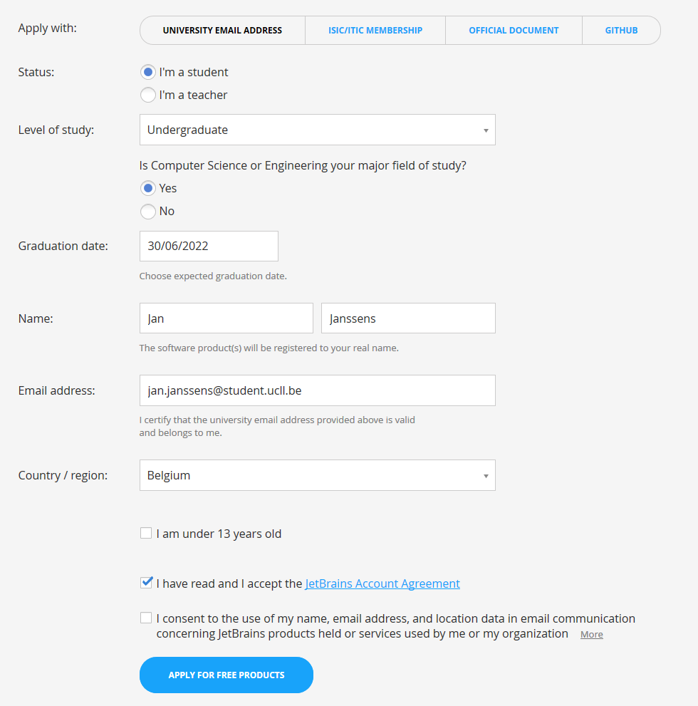

# IntelliJ

## Software

Download [IntelliJ](https://www.jetbrains.com/idea/download/).

* Kies eerst je besturingssysteem (Windows/MacOS/Linux).
* Download de Ultimate editie.

## Studentenlicentie

Vraag een [studentenlicentie](https://www.jetbrains.com/shop/eform/students). Gebruik hierbij je UCLL e-mailadres.

Je zal je registratiecode ontvangen via e-mail.
