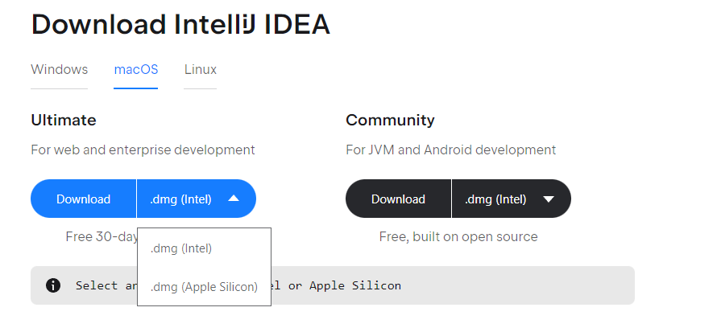
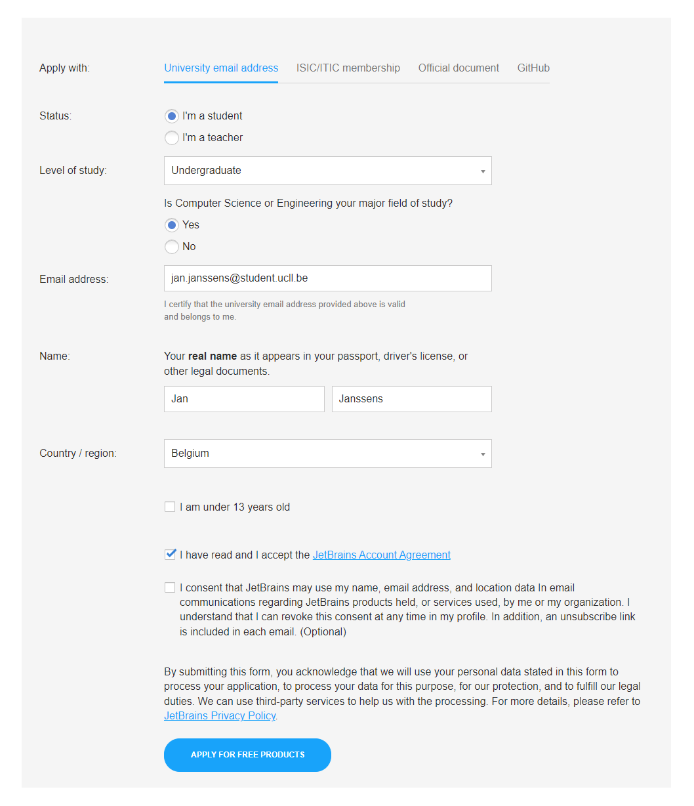
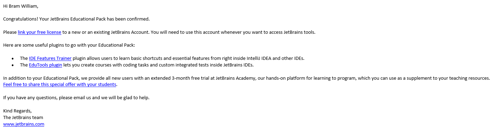
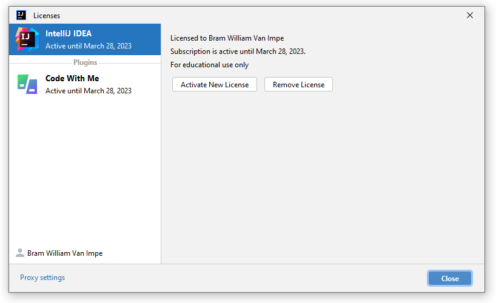

# IntelliJ

## Installatie

1. Navigeer naar de <a href="https://www.jetbrains.com/idea/download" target="_blank">download-pagina</a>
1. Download de installer voor jouw besturingssysteem
1. Kies de **Ultimate** editie
    * Gebruik je macOS? Kies de versie die bij je processor past (Intel of Apple Silicon). Als je niet zeker bent of je een Intel of Apple processor hebt, kijk dan <a href="https://support.apple.com/nl-be/HT211814" target="_blank">hier</a>.

    
    **Figuur 1** macOS: Kies de juiste versie!

### Licentie Aanvragen

1. Vraag een <a href="https://www.jetbrains.com/shop/eform/students" target="_blank">studentenlicentie</a> aan
    * Gebruik je eigen naam en je UCLL e-mailadres (in de vorm `voornaam.familienaam@student.ucll.be`)
    * Zie onderstaande screenshot voor een voorbeeld van een ingevuld formulier

    
    **Figuur 2** Registratieformulier voorbeeld (gebruik uiteraard je eigen naam)

### Registreren

1. Je zal via mail bevestiging krijgen dat het aanvragen van je licentie geslaagd is

    
    **Figuur 3** Bevestigingsmail

1. Link je key aan een account door op `link your free license` te klikken
    * Maak een nieuw account aan met je UCLL e-mailadres
1. Open IntelliJ
1. Navigeer in de menu bar naar `Help >> Register`
1. Log in met je account waar de licentie aan gekoppeld is

## Controle

1. Open IntelliJ IDEA
1. Navigeer in de menu bar naar `Help >> Register`
1. Controleer of je licentie oké is

    
    **Figuur 4** Succesvol geregistreerd

