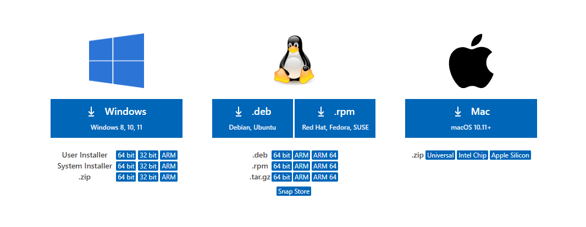

# Visual Studio Code

## Installatie

1. Navigeer naar de <a href="https://code.visualstudio.com/download" target="_blank">download-pagina</a>
1. Download de juiste installer
    * Gebruik je Windows? Kies dan voor de System Installer 64bit.
    * Gebruik je macOS? Kies de versie die bij je processor past (Intel Chip of Apple Silicon knop). Als je niet zeker bent of je een Intel of Apple processor hebt, kijk dan <a href="https://support.apple.com/nl-be/HT211814" target="_blank">hier</a>.

    
    **Figuur 1** Kies de juiste installer!

1. Voer de installer uit
    * Gebruik je Windows? Hou rekening met onderstaande instellingen:
        * Installeer Visual Studio Code in de voorgestelde locatie
        * Laat de installer "Open with Code" toevoegen aan het context menu (zowel file als directory)
        * Laat de installer het programma toevoegen aan het PATH

## Controle

1. Open Visual Studio Code