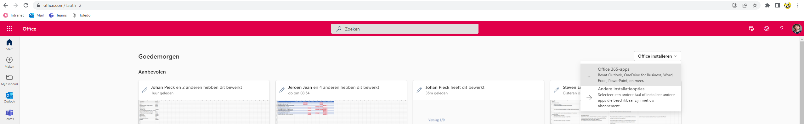
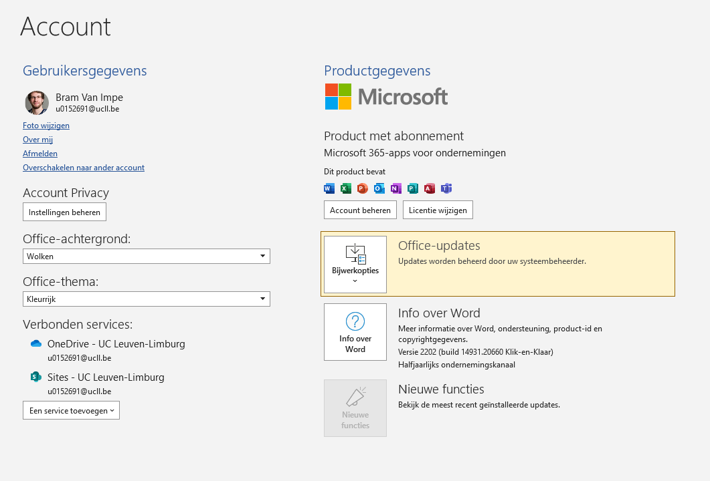

# Microsoft Office

## Installatie

1. Navigeer naar <a href="https://www.office.com/" target="_blank">deze pagina</a>
1. Meld aan met je UCLL e-mailadres (in de vorm `voornaam.familienaam@student.ucll.be`)
1. Klik op `Office Installeren >> Office 365-apps`

    
    **Figuur 1** Installatie knop

1. Volg de installer en log in met je UCLL-account
    * Installeer alle apps

## Controle

1. Open Microsoft Word
1. Klik links-onder op Account
1. Verifieer dat je ingelogd bent

    
    **Figuur 2** Licentie oké

