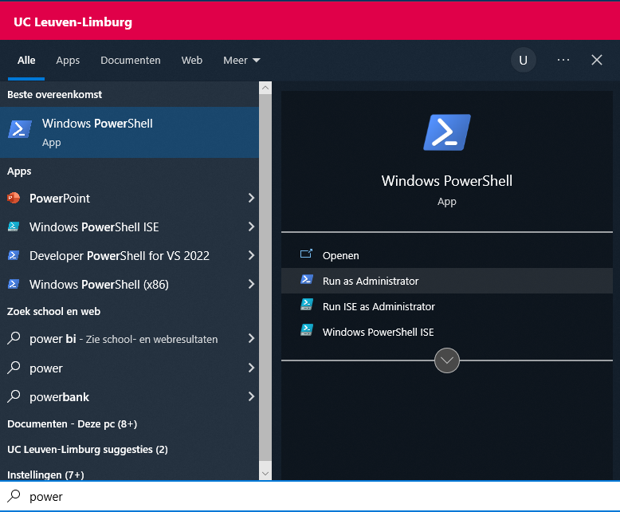

# WSL (Windows Subsystem for Linux)

Deze installatie is enkel voor Windows gebruikers.

## Installatie

1. Navigeer naar <a href="https://docs.microsoft.com/en-us/windows/wsl/install" target="_blank">deze pagina</a>
1. Volg de instructies op de pagina
    * Een administrator PowerShell kan je openen door te zoeken in het start menu (zie onderstaande screenshot)

        
        **Figuur 1** Openen van een administrator PowerShell

    * Kies voor de standaard distributie (Ubuntu)

## Controle

1. Zoek naar Ubuntu in het start menu
1. Open Ubuntu en maak een gebruiker aan
    * Onthoud het wachtwoord! Je zal dit regelmatig nodig hebben bij gebruik.
