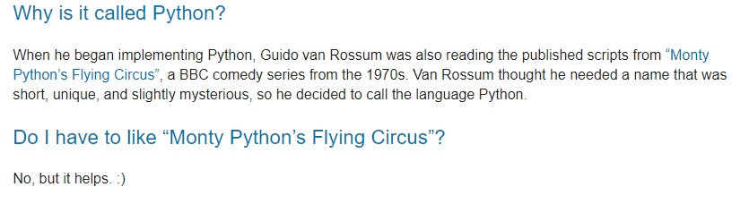

# Python & Git

## Stappenplan

Voer volgende instructies uit:

1. [Python](./python/index.md)
1. [Git](./git/index.md)
1. [GitHub](./github_account/index.md)

## Trivia

* Geen idee wat git is? Dit filmpje geeft je al een eerste indruk:

    

* Wat is Github dan? Eenvoudig gezegd is Github een server voor git-repositories. Het voordeel van je repository beschikbaar te maken op een platform als GitHub is dat iedereen die je wil je code kan bereiken. <a href="https://www.howtogeek.com/180167/htg-explains-what-is-github-and-what-do-geeks-use-it-for/" target="_blank">Hier</a> vind je nog wat meer informatie.
* Ook deze website maakt gebruik van git en GitHub. De bron-bestanden zijn opgeslaan in een git-repository die het mogelijk maakt om aanpassingen op te volgen en te coördineren tussen meerdere gebruikers. De repository wordt gehost op GitHub. Je kan deze <a href="https://github.com/UCLeuvenLimburg/software" target="_blank">hier</a> bekijken als je geïnteresseerd bent.
* Van Python als programmeertaal heb je vast al gehoord. De <a href="https://docs.python.org/3/faq/general.html#id2" target="_blank">Python FAQ</a> heeft een antwoord op alle vragen die je over Python kan hebben. We halen er alvast één weetje uit:

    