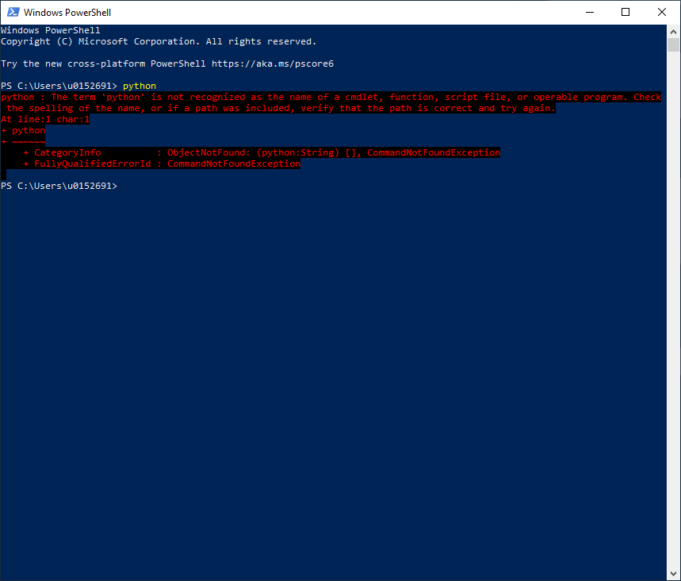

# Python

## Vooraf - Windows

**Deze sectie is enkel voor Windows gebruikers.**

1. Het `python` commando wordt op Windows 10 onderschept en leid je naar de Windows store. We gaan dit eerst uitschakelen omdat dit zeer verwarrend is en je potentieel met meerdere python versies opzadelt.
1. Zoek op *Apps and Features* (of *Apps en Onderdelen*) in het start-menu, open dit scherm
1. Klik op *Manage app execution aliases* (of *Aliassen voor app-uitvoering*)
1. Zet de checkbox achter de App-installatieprogramma's `python.exe` en `python3.exe` uit
1. Open PowerShell door te zoeken in het start-menu en tik `python`, controleer dat je output is zoals op de onderstaande screenshot. Je wil niet dat de Windows store opent.

    
    **Figuur 1** python commando leidt niet meer naar de Windows store

## Installatie

1. Navigeer naar de <a href="https://www.python.org/downloads/" target="_blank">download-pagina</a>
1. Let op! De pagina opent standaard op Windows. Kijk na of je de versie voor jouw OS downloadt.
    * Kies voor 64bit op Windows
    * Installeer python3. python2 hoef je *niet* te installeren.
1. Kies tijdens de installatie voor Install Now (de standaard-installatie)
    * Gebruik je Windows? Duid de checkbox `Add Python to PATH` aan
    
## Controle

### Windows

1. Open PowerShell door te zoeken in het start-menu
1. Tik `py --version` en valideer dat je de python versie ziet

### macOS

1. Open een terminal (voer `terminal` in in Spotlight Search)
1. Tik `python3 --version` en valideer dat je de python versie ziet
