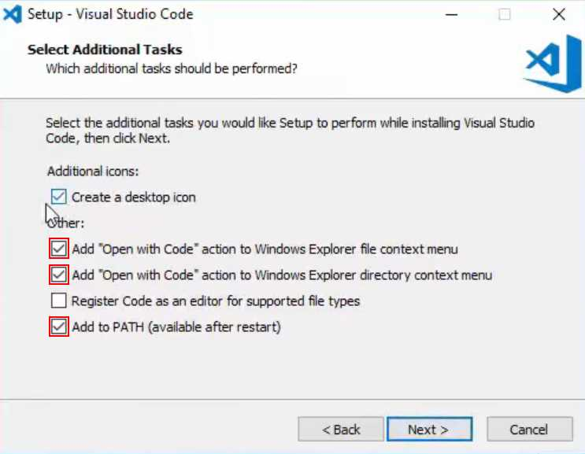

# Visual Studio Code

## Windows

1. [Download Visual Studio Code](https://code.visualstudio.com/). Kies hierbij voor de Stable build.
2. Start het installatieprogramma.
3. Klik doorheen de venstertjes, rekening houdend met de volgende opties:
   * Installeer het in de voorgestelde locatie.
   * Laat het "Open with Code" toevoegen aan het context menu (zowel file als directory).
   * Laat het zichzelf toevoegen aan de PATH.

## MacOS

Volg deze instructies (kan ook bekeken worden als [Youtube filmpje](https://www.youtube.com/watch?v=IdS2KmTPVEc):

1. [Download Visual Studio Code](https://code.visualstudio.com/). Kies hierbij voor de Stable build.
2. Dubbelklik op het gedownloade archief.
3. Sleep `Visual Studio Code.app` naar de Applications folder.